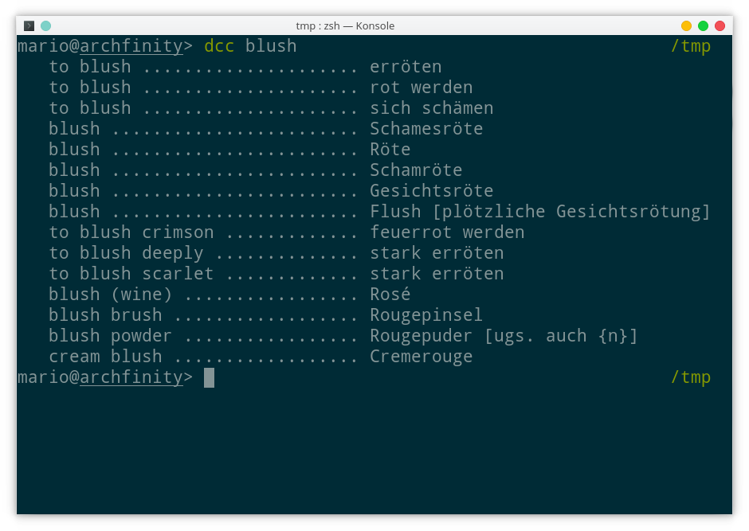

# d[ict.cc ]c[li ]c[lient]

dcc is a commandline tool to translate all the words :star2:.

:exclamation:_***nix instructions only**_ :exclamation:

## Build dcc 

To build dcc clone the git repo and change into it

```shell
git clone https://github.com/aichingm/dcc && cd dcc
```

**Done!** dcc is written in php no need to build something.

### That was not the whole truth

If you want to package dcc you should change the `VERSION` in the dcc.php file to the commit hash of the commit from which you are packaging. This actually helps debugging user related problems!

Do it like they to on the discovery channel :notes::

```bash
_commit_s=$(git rev-parse --short HEAD) && sed -i "5s/.*/    define(\"VERSION\", \"$_commit_s\");/" 
```

## Run dcc 

```bash
php dcc.php
```

### Run it with comfort 

Move the file dcc.php to dcc, make it executable and move it to any directory listed in your  `$PATH` variable  (maybe not any, `/usr/local/bin` should work fine ). 

```bash
mv dcc.php dcc && chmod +x dcc && sudo mv dcc /usr/local/bin
```


 ## But what does it look like?




## Make it your own

Besides all the commandline switches you can configure dcc via an `.ini` file. This file has to be located in `~/.config/dcc/` and its name has to be `dcc.ini` 

### Creating a default configuration file

Copy the output of `dcc -c` to secret location (`~/.config/dcc/dcc.ini`)

```bash
dcc -c > ~/.config/dcc/dcc.ini
```

Now fire up the best editor ever and edit your configuration file:

```bash
vim ~/.config/dcc/dcc.ini && echo vim rules!!1
```


### Things you can change

* DEFAULT_FLAGS: a list of flags which should be used on every call to dcc.
* LANG_FROM: the language which the words are from.
* LANG_TO: the language you don't know or speak.
* PAGER: Don't change this if you don't know what a page is.
* REVERSE: set REVERSE to true for whatever reason you can find :confounded:
* PADDING: the amount of PAD_CHARs which will be used to separate the words.
* LEFT_PADDING: how much spaces do you want on the left side of the terminal?
* PED_CHAR: the character used to separate the words.
* RESULTS: how much translations do you want to see at most.

## Examples :lollipop: 

Examples are included in to dcc you can find them way deep in the source code or run:

```bash
dcc -e
```

 _e stands for examples_

## Help I need somebody, HELP...

For help call 911! Or just run:

```bash
dcc -h
```

_Note: don't call 911 they don't know dcc!_

